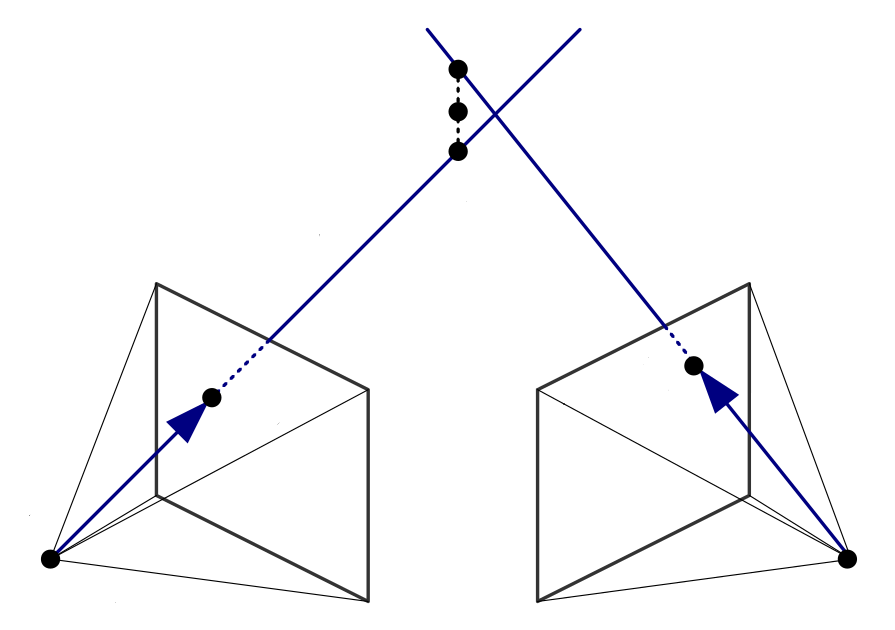
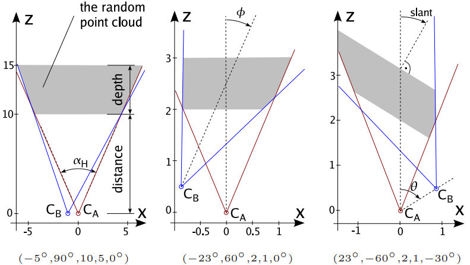

# Prva laboratorijska vježba: geometrija dvaju pogleda

Mnoge metode računalnog vida razmatraju scenarij 
gdje je na temelju više pogleda na scenu 
potrebno izlučiti relativnu orijentaciju kamera
i rekonstruirati trodimenzionalnu strukturu scene.
Sasvim općenito, možemo reći da te metode
razmatraju rekonstrukciju geometrije više pogleda.
Vrlo važan specijalni slučaj razmatra jednu kameru 
koja se giba kroz scenu koja se sastoji 
od pokretnih objekata i nepokretne pozadine. 
U tom slučaju možemo pričati o izlučivanju 
strukture iz kretanja (eng. structure from motion).

Metode 3D rekonstrukcije možemo podijeliti 
na kalibrirani i nekalibrirani slučaj.
Kalibrirani slučaj imamo kada piksele
možemo jednoznačno preslikati 
na jediničnu sferu sa središtem u žarištu kamere.
Nekalibrirani slučaj imamo kada naš program
ne zna s kojom kamerom je pribavljena slika.
Radi jednostavnosti, u ovoj vježbi razmatrat ćemo
samo kalibrirani slučaj koji je i najvažniji u praksi.

Sve metode 3D rekonstrukcije u prvom koraku
izlučuju relativnu orijentaciju (eng. relative orientation) dvaju kamera
pa ćemo upravo taj zadatak razmatrati i u ovoj vježbi.
Zadatak ćemo rješavati pod pretpostavkom 
da je koordinatni sustav svijeta poravnat 
s koordinatnim sustavom prve kamere.
Ta pretpostavka neće smanjiti općenitost rješenja.
Stoga, projekcijska matrica prve kamere biti će 
$$\mathbf{P}_a = \left\lbrack \mathbf{I} | \mathbf{0} \right\rbrack$$,
dok će naš postupak trebati izlučiti 
projekcijsku matricu druge kamere 
$$\mathbf{P}_b = \left\lbrack \mathbf{R} | \mathbf{t} \right\rbrack$$.

Valja napomenuti da će svi naši postupci moći izlučiti 
samo smjer translacije ali ne i njen iznos.
Razlog tome je nemogućnost razlikovanja 
iznosa translacije od globalnog mjerila 
trodimenzionalne rekonstrukcije scene.
Drugim riječima, ako umjesto prave scene
promatramo $$s\times$$ umanjenu maketu
te s jednakim faktorom $$s$$ umanjimo 
i pomak druge kamere -
dobit ćemo iste slike kao i u originalnom slučaju. 

## Triangulacija strukture

Pretpostavimo za trenutak da smo uspjeli izlučiti 
relativnu orijentaciju te da želimo rekonstruirati 
trodimenzionalnu strukturu scene.
Dakle, poznate su projekcijske matrice obje kamere, 
$$\mathbf{P}$$<sub>a</sub>
i 
$$\mathbf{P}$$<sub>b</sub>
kao i korespondentne točke $$\mathbf{q}_{a}$$ i $$\mathbf{q}_{b}$$,
a naš zadatak je odrediti 3D položaj $$\mathbf{Q}$$.



Slika pokazuje da je općeniti slučaj triangulacije 
znatno teži od stereoskopskog određivanja dubine.
U prisustvu šuma, poluzrake koje odgovaraju 
korespondentnim pikselima neće biti koplanarne 
[(szeliski22book)](https://szeliski.org/Book/).
Stoga tražimo rekonstrukciju koja se ne nalazi
na niti jednoj od dviju zraka.
Najmanje kriva bila bi ona rekonstrukcija 
čija reprojekcija bi bila najmanje udaljena
od izmjerenih položaja korespondentnih točaka.
Međutim, takav postupak zahtijevao bi 
nelinearnu združenu optimizaciju 
svih rekonstruiranih točaka
zajedno s dvjema projekcijskim matricama 
[(engels06isprs)](https://www.isprs.org/proceedings/XXXVI/part3/singlepapers/O_24.pdf).
Za potrebe ove vježbe, zadovoljit ćemo se s 
jednostavnijim rješenjem koje dobro funkcionira u praksi.

Problemu možemo pristupiti na način
da primijetimo da su ograničenja
linearna u svim nepoznanicama.
Ako se točka $$\mathbf{Q}$$ u koordinatnom sustavu svijeta
preslikava u točke $$\mathbf{q}_a$$ i $$\mathbf{q}_b$$,
onda vrijede sljedeće jednadžbe:

$$\lambda_a\mathbf{q}_a=\mathbf{P}_a\mathbf{Q}$$

$$\lambda_b\mathbf{q}_b=\mathbf{P}_b\mathbf{Q}$$

Poznate vrijednosti su
$$\mathbf{q}_a$$, 
$$\mathbf{q}_b$$,  
$$\mathbf{P}_a$$ i 
$$\mathbf{P}_b$$,
a želimo naći $$\mathbf{Q}$$.
Nepoznate multiplikativne faktore 
$$\lambda_a$$ i $$\lambda_b$$
možemo izbaciti iz igre 
na način da obje strane vektorski
pomnožimo s odgovarajućom točkom slike.
Dobivamo sljedeći linearni sustav u kojem 
svaka kamera doprinosi dva 
linearno nezavisna ograničenja:
$$[\mathbf{q}_c]_\times \mathbf{P}_c \cdot \mathbf{Q}=0, c \in{a,b}$$
Tako dobivamo homogeni linearni sustav
s četiri jednadžbe i četiri nepoznanice:

$$\mathbf{M}_{4\times 4} \cdot \mathbf{Q}_{4\times 1}=0$$

Standardan pristup za rješavanje ovakvih sustava
temelji se na [singularnoj dekompoziciji](https://en.wikipedia.org/wiki/System_of_linear_equations#Homogeneous_systems).
Preciznije, netrivijalno rješenje sustava 
koje minimizira algebarski rezidual odgovara 
[desnom singularnom vektoru](https://en.wikipedia.org/wiki/Singular_value_decomposition#Solving_homogeneous_linear_equations) 
matrice $$\mathbf{M}$$ koji odgovara njenoj najmanjoj singularnoj vrijednosti.


## Sintetički eksperimentalni postav

Metode relativne orijentacije kamera 
teško je evaluirati na stvarnim slikama
zbog teškog mjerenja stvarnih pomaka.
Zbog toga ćemo ovu vježbu provoditi
na sintetičkom eksperimentalnom postavu
gdje dvije kamere promatraju 
slučajni oblak točaka.
Radi jednostavnosti, obje kamere 
nalaze se u ravnini x-z referentne kamere,
a udaljenost među ishodištima kamera
uvijek ima jediničnu normu.
Stoga pomak druge kamere nedvosmisleno možemo opisati
pomakom smjera gledanja druge kamere 
te orijentacijom spojnice dvaju ishodišta.
Oblak točaka instanciramo u kvadru za kojeg zadajemo
udaljenost od referentne kamere i dubinu.
Stoga, eksperimentalni postav 
zadajemo sljedećim parametrima:
- $$\theta$$: smjer gledanja kamere C<sub>B</sub> u odnosu na referentnu kameru C<sub>A</sub> (stupnjevi)
- $$\phi$$: smjer pomaka kamere C<sub>B</sub> u odnosu na referentnu kameru C<sub>A</sub> (stupnjevi)
- $$D$$: udaljenost oblaka točaka,
- $$d$$: dubina oblaka točaka,
- $$\delta$$: nagib oblaka točaka,
- $$N$$: broj točaka.
Sljedeća slika ilustrira navedene parametre 
i prikazuje tri konkretne konfiguracije:



Slika ilustrira i kako se oblak točaka instancira
samo u dijelovima scene koji su vidljivi u obje kamere
[(segvic07bencos)](https://vision.middlebury.edu/conferences/bencos2007/pdf/segvic.pdf).
Da bismo to mogli provesti, potrebni su nam 
intrinsični parametri kamera
(pretpostavljamo da obje kamere imaju iste parametre).
Konačno, kako bismo izmjerili otpornost metode na šum,
svakoj projiciranoj točci dodajemo
slučajan normalni šum varijance $$\sigma$$.
Stoga valja zadati i sljedeće parametre eksperimentalnog postava:
- `\alpha_H`: horizontalno vidno polje u stupnjevima,
- `w`, `h`: dimenzije slike,
- $$\sigma$$: standardna devijacija šuma u pikselima.

Eksperimentalni postav možemo instancirati
primjenom sljedećeg 
[programa](../src/create_2vg_setup.cxx).
Program bi se trebao moći prevesti 
s bilo kojim standardnim prevoditeljem
(mi smo testirali g++ i MSVC).
Javite ako bude bilo bilo kakvih problema.
Parametri postava zadaju se u naredbenom retku. 
Evo primjera naredbenog retka koji 
instancira postav na lijevoj slici:
```
./create_2vg_setup -5_90_10_5_0_10000 45_384_288_100 >exp.data
```
Navedeni primjer zadaje $$\theta=-5^\circ$$,
$$\phi=90^\circ$$, $$D=10$$, $$d=5$$, $$\delta=0$$,
$$N=10000$$, $$\alpha_H$$=$$45^\circ$$,
`w`,`h`=384,288, $$\sigma=1.00$$.
Primijetite da zbog lakšeg parsanja,
program zahtijeva da sve parametre upišemo
kao cjelobrojne konstante te 
da se zadaje standardna devijacija pomnožena sa 100.
Ako za prvi argument zadamo xx, smjer gledanja druge kamere
odabrat će se tako da presjecište smjerova gledanja
bude u sredini oblaka točaka. Evo primjera:
```
./create_2vg_setup xx_00_10_5_0_10000 45_384_288_100 >exp.data
```

Program za kreiranje postava ispisuje 
projekcijsku matricu druge kamere
te dva polja po N projiciranih točaka 
za dvije kamere pretpostavljenog postava.
Pojedini elementi ispisa razdvojeni su praznim retkom.
U svim prikazanim primjerima, ispis programa 
preusmjerava se u datoteku `exp.data`, ali u praksi, 
ako program pokrećemo iz naredbenog retka,
možemo koristiti i ulančavanje procesa. 
Matricu kamere `P` te vektore točaka `qas` i `qbs`
iz Pythona možemo čitati sljedećim kodom:
```
import numpy as np
import itertools
import sys

def makegen(f):
  return ( np.array([float(c) 
    for c in line[1:-2].split(',')])
      for line in itertools.takewhile(lambda x: x != "\n", f))

# f = open('exp.data')
f = sys.stdin
line = f.readline().split('),(')
line[0] = line[0][7:]
line[2] = line[2][:-3]
P = np.array([ [float(x)  for x in row.split(',')] for row in line])
f.readline()

qas = np.array(list(makegen(f)))
qbs = np.array(list(makegen(f)))
```

## Algoritam s osam točaka

Algoritam s osam točaka temelji se na epipolarnom ograničenju
koje možemo zapisati kao bilinearnu formu
nad homogenim prikazima korespondentnih točkaka 
$$\mathbf{q_{ia}} = (x_{ia}, y_{ia}, 1)$$ i 
$$\mathbf{q_{ib}} = (x_{ib}, y_{ib}, 1)$$ 
te nepoznatom esencijalnom matricom $$\mathbf{E}$$:

$$\mathbf{q_{ib}}^\top \cdot \mathbf{E} \cdot \mathbf{q_{ia}} = 0$$.

Podsjetimo se, epipolarno ograničenje 
kaže da su prikazi točke $$\mathbf{Q}$$ 
u koordinatnim sustavima dvaju kamera
koplanarni sa spojnicom dvaju žarišta.
Epipolarno ograničenje možemo presložiti
tako da 9 parametara matrice $$\mathbf{E}$$ 
istaknemo kao nepoznanice
te ga zapisati u homogenom matričnom obliku kako slijedi:

$$ {\left\lbrack \matrix{x_{ib}x_{ia} & x_{ib}y_{ia} & x_{ib} & y_{ib}x_{ia} & y_{ib}y_{ia} & y_{ib} & x_{ia}       & y_{ia}       & 1} \right\rbrack} 
\cdot \left\lbrack \matrix{e_{11} \cr e_{12} \cr e_{13} \cr e_{21} \cr e_{22} \cr e_{23} \cr e_{31} \cr e_{32} \cr e_{33}} \right\rbrack
= 0 
$$

Ako prikupimo n korespondencija, dobit ćemo 
homogeni linearni sustav s viškom ograničenja
koji rješavamo standardnom metodom (SVD):

$$\mathbf{M}_{n\times 9}\cdot \mathbf{e}_{9\times 1}=\mathbf{0}_{n\times 1}$$

## Dekompozicija esencijalne matrice i procjena pogreške

Esencijalna matrica koju smo dobili 
rješavanjem homogenog linearnog sustava 
ima 8 stupnjeva slobode.
Međutim, mi znamo da esencijalna matrica
ima samo 5 stupnjeva slobode jer vrijedi:
$$\mathbf{E} = [\mathbf{t}]_\times \mathbf{R}$$.
Nadalje, mi znamo da matrica 
$$\mathbf{E}$$ nema puni rang,
jer epipolarno ograničenje degenerira u epipolovima
(epipol je projekcija žarišta druge kamere):

$$\mathbf{E} \cdot \mathbf{e}_a = 
  \mathbf{e}_b^\top \cdot \mathbf{E} = \mathbf{0}.$$

Zbog toga ćemo izlučenu matricu "približiti"
mnogostrukosti esencijalnih matrica na način 
da i) provedemo singularnu dekompoziciju,
matricu singularnih vrijednosti postavimo na
$$\mathbf{D} = \mathrm{diag}(1,1,0)$$
i rekombiniramo faktore kao što predlaže teorem 2 u 
[(nister04pami)](https://citeseerx.ist.psu.edu/viewdoc/download?doi=10.1.1.86.8769&rep=rep1&type=pdf).

Sada možemo formulirati postupak 
dekompozicije esencijalne matrice
na faktore pomaka druge kamere - 
$$\mathbf{R}$$ i $$\mathbf{t}$$.
Neka je zadana singularna dekompozicija
korigirane esencijalne matrice:  

$$
  \mathbf{E}=\mathbf{U}
    \cdot
    \mathrm{diag}(1,1,0) 
    \ssprtran{V}^\top
$$
  
Tada pomak druge kamere odgovara trećem lijevom singularnom vektoru:
    
$$\mathbf{t}=\pm\ssprtran{U}_{:3}$$
  
Nadalje, dobivamo dvije hipoteze za rotacijsku matricu:
  
$$\mathbf{R}_a=\mathbf{U}\cdot
      \left\lbrack\array{0&-1&0 \cr 1&0&0 \cr 0&0&1} \right\rbrack
      \cdot\mathbf{V}^\top$$
      
$$\mathbf{R}_b=\mathbf{U}\cdot
      \left\lbrack\array{0&1&0 \cr -1&0&0 \cr 0&0&1} \right\rbrack
      \cdot\mathbf{V}^\top$$
  
Moramo uzeti u obzir da translacijski pomak 
može biti negativan i pozitivan
pa konačno dobivamo četiri hipoteze:  
- ($$\mathbf{R}_a$$, $$\mathbf{t}$$),
- ($$\mathbf{R}_a$$, $$-\mathbf{t}$$),
- ($$\mathbf{R}_b$$, $$\mathbf{t}$$),
- ($$\mathbf{R}_b$$, $$-\mathbf{t}$$)

Odabir točne hipoteze provodimo trianguliranjem korespondencija.
Pobjeđuje ona hipoteza za koju se najveći broj 
rekonstrukcija nalazi _ispred_ obje kamere.

## Poboljšanje osnovnog postupka normalizacijom koordinata korespondencija
  Literatura: [(hartley97pami)](https://www.cse.unr.edu/~bebis/CS485/Handouts/hartley.pdf)


## Zadatci

U ovoj vježbi usredotočit ćemo se na sljedeće konfiguracije:
- deset različitih pomaka: $$\theta \in$$ `range(0,91,10)` (stupnjevi)
- konvergentni kutevi gledanja: $$\phi$$ = `'xx'`
- D,d,$$\delta$$ = 10,5,0
- N = 10000
- uobičajena širina vidnog polja: $$\alpha_H$$ = $$45^\circ$$ 
- `w`,`h` = 384, 288
- standardna devijacija pogreške: jedan piksel, $$\sigma$$ = 1.00

### Nenormalizirani postupak

Ispitni program treba za svaki pomak provesti 
nexp=100 eksperimenata nad uzorkom 
od szSample=50 slučajnih parova točaka,
rekonstruirati relativnu orijentaciju 
nenormaliziranim algoritmom s osam točaka
te zabilježiti kutnu pogrešku 
rekonstruiranog vektora translacije.

### Normalizirani postupak

U drugom dijelu vježbe potrebno je uključiti
Hartleyevu normalizaciju te 
usporediti dvije varijante postupka
na grafu točnost - $$\theta$$ za 
$$\theta \in$$ `range(0,91,10)` (stupnjevi).

### Robusna estimacija (bonus)

Izmjeriti robusnost postava za $$\theta$$ = $$90^\circ$$
  tako da se prikaže grafička ovisnost točnosti
  o udjelu uvedenih lažnih korespondencija.
  Točke lažnih korespondencija valja nasumično uzorkovati
  iz uniformne distribucije koja pokriva cijelu sliku.
  
  Izmjerenu točnost osnovne metode 
  treba usporediti s robusnom metodom 
  utemeljenoj na konsenzusu slučajnog uzorka (RANSAC).

  Literatura: [(nister04pami)](https://citeseerx.ist.psu.edu/viewdoc/download?doi=10.1.1.86.8769&rep=rep1&type=pdf).


<!--
## Rekonstrukcija 3D strukture (bonus)

Izmjeriti točnost 3D rekonstrukcije  
-->

