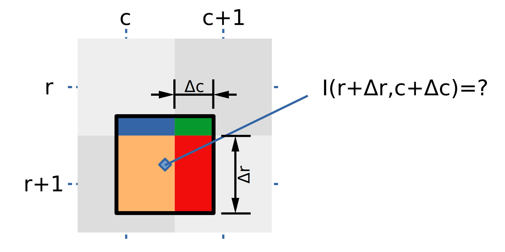
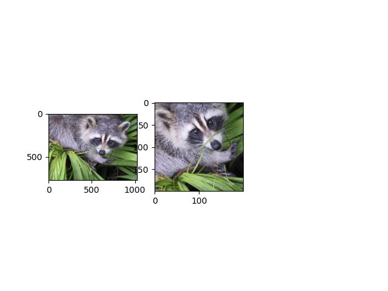

# Prva vježba: geometrijske deformacije slika

U računalnom vidu često trebamo modificirati slike 
različitim geometrijskim deformacijama
kao što su uvećanje, rotiranje ili izrezivanje.
Ova laboratorijska vježba razmatra _unatražne_ deformacije
koje se najčešće koriste u praksi.
Označimo ulaznu sliku s $$I_s$$, 
izlaznu sliku s $$I_d$$,
vektor cjelobrojnih pikselskih koordinata s $$\mathbf{q}$$
te parametriziranu koordinatnu 
transformaciju s $$\mathbf{T}_p$$.
Tada unatražnu deformaciju slike 
možemo formulirati sljedećim izrazom: 

$$I_d (\mathbf{q}) = I_s (\mathbf{T}_p(\mathbf{q})) \ .$$

Kako slike tipično imaju dvije geometrijske osi,
i domena i kodomena koordinatnih transformacija 
odgovarat će Euklidskoj ravnini: 
$$\mathbf{T}_p : \mathbb{R}^2 \rightarrow \mathbb{R}^2$$.
U praksi se koriste različite 
vrste geometrijskih transformacija,
ali najčešće koristimo 
afine, projekcijske i radijalne transformacije.
Afine i projekcijske transformacije 
čuvaju kolinearnost točaka,
dok radijalne transformacije ne utječu na 
udaljenost od ishodišta koordinatnog sustava.

## Afine transformacije

Označimo početni 2D vektor realnih koordinata s $$\mathbf{q}_s$$,
konačni 2D vektor realnih koordinata s $$\mathbf{q}_d$$, 
linearno ravninsko preslikavanje s $$A$$,    
te 2D pomak s $$b$$.
Tada afinu transformaciju ravnine 
možemo prikazati sljedećom jednadžbom: 

$$\mathbf{q}_s = \mathbf{T}_p(\mathbf{q}_d) = \mathbf{A} \cdot \mathbf{q}_d + \mathbf{b} \ .$$

Tablica prikazuje hijerarhijski popis 
vrsta afinih transformacija 
tako da svaka sljedeća vrsta 
odgovara poopćenju prethodne
($$\mathbf{I}$$=$$\mathrm{diag}(1,1)$$,
 $$\mathbf{R}$$ je matrica rotacije 2D podataka): 

| *transformacija*                | *stupnjevi slobode* | *invarijante* | *ograničenja* |
| ----------------                | ------------------- | ------------- | --------- |
| translacija                     |           2         | orijentacija  | $$\mathbf{A}=\mathbf{I}$$ |
| transformacija krutog tijela    |           3         | udaljenost    | $$\mathbf{A}=\mathbf{R}$$, $$\mathbf{R}^\top\mathbf{R}=\mathbf{I}$$ |
| sličnost                        |           4         | kutovi        | $$\mathbf{A}=s\mathbf{R}$$, $$\mathbf{R}^\top\mathbf{R}=\mathbf{I}$$ |
| općenita afina transformacija   |           6         | paralelnost   | nema |

Ako se odnos između dvije slike
može opisati afinom deformacijom,
onda parametre koordinatne transformacije
možemo izlučiti iz korespondencija.
Neka su u izvorišnoj slici 
$$I_s$$
zadane točke
$$\mathbf{q}$$<sub>si</sub>.
Neka su u odredišnoj slici 
$$I_d$$
zadane korespondentne točke 
$$\mathbf{q}_{di}$$.
Tada za svaki par korespondencija vrijedi:

$$\eqalign{
q_{si1} &= a_{11} q_{di1} + a_{12} q_{di2} + b_1\\  
q_{si2} &= a_{21} q_{di1} + a_{22} q_{di2} + b_2}
$$

Ove dvije jednadžbe možemo presložiti
tako da 6 parametara afine transformacije 
istaknemo kao nepoznanice
te ih zapisati u matričnom obliku kako slijedi:

$$ 
\left\lbrack \matrix{q_{si1} \cr q_{si2}} \right\rbrack =
  \left\lbrack \matrix{q_{di1} & q_{di2} & 0 & 0 & 1 & 0\cr 0 & 0 & q_{di1} & q_{di2} & 0 & 1} \right\rbrack
  \cdot 
  \left\lbrack \matrix{a_{11} \cr a_{12} \cr a_{21} \cr a_{22} \cr b_{1} \cr b_{2}} \right\rbrack
$$

Ako dodamo još dvije korespondencije, dobit ćemo sustav $$6\times 6$$
koji ima jedinstveno rješenje, osim ako su korespondencije kolinearne.
Tražena deformacija biti će određena rješenjem tog sustava.

## Projekcijske transformacije

Projekcijske transformacije ravnine 
možemo prikazati sljedećom jednadžbom:

$$\mathbf{q}_s = \mathbf{T}_p(\mathbf{q}_d) = 
  \frac{\mathbf{A} \cdot \mathbf{q}_d + \mathbf{b}}
       {\mathbf{w}^\top\mathbf{q}_d + w_0} \ .$$

Primijetite da je brojnik jednadžbe - vektor a nazivnik - skalar.
Matrica $$\mathbf{A}$$, 
vektori $$\mathbf{b}$$ i $$\mathbf{w}$$
te skalar $$w_0$$ su parametri projekcijske transformacije.
Parametre projekcijske transformacije 
možemo odrediti iz korespondencija
na vrlo sličan način kao i za afine transformacije.
Međutim, u ovom slučaju svaka korespondencija
doprinosi dva _homogena_ linearna ograničenja
nad parametrima transformacije, do kojih dolazimo 
prebacivanjem nazivnika na lijevu stranu jednadžbe.
To možemo napraviti kad god su korespondencije konačne
jer je tada nazivnik sigurno različit od nule.
Ako prikupimo $$n$$ korespondencija, 
dobit ćemo homogeni linearni sustav 
s $$2n$$ jednadžbi i devet nepoznanica oblika 
$$\mathbf{M}\mathbf{x}=\mathbf{0}$$.
Za vježbu raspišite koeficijente linearnog sustava 
za jednu korespondenciju!

S obzirom na to da su naše jednadžbe homogene,
parametre projekcijske parametre možemo odrediti 
samo do proizvoljne multiplikativne konstante 
$$\lambda\neq 0$$. 
Odatle zaključujemo da projekcijska transformacija 
ima samo osam stupnjeva slobode.
Stoga ne čudi da će sustav $$\mathbf{M}$$ 
imati točno jedno netrivijalno rješenje
i ako prikupimo samo četiri korespondencije,
pod pretpostavkom da niti jedna trojka korespondencija nije kolinearna.
Rješenje sustava odgovara 
[desnom singularnom vektoru](https://en.wikipedia.org/wiki/Singular_value_decomposition#Solving_homogeneous_linear_equations)
matrice $$\mathbf{M}$$
koji odgovara singularnoj vrijednosti nula.
Ako imamo višak ograničenja (više od 4 korespondencije)
optimalno rješenje u algebarskom smislu
dobivamo kao desni singuarni vektor
koji odgovara najmanjoj singularnoj vrijednosti matrice $$\mathbf{M}$$.

Napominjemo da ovom problemu možemo pristupiti
i ako odaberemo projekcijski prikaz korespondencija.
U tom slučaju pokazalo bi se da projekcijsko preslikavanje
možemo izraziti linearnom transformacijom
homogenih koordinata točaka projekcijske ravnine.
Projekcijski prikaz doveo bi do tri jednadžbe 
po svakoj korespondenciji, 
a dvije od tih triju jednadžbi 
bile bi jednake kao i gore.
To nije veliki nedostatak 
jer bismo i inače mogli koristiti
samo dvije jednadžbe jer treća jednadžba
odgovara linearnoj kombinaciji prve dvije.
Jedna prednost projekcijskog pristupa
jest mogućnost jednostavnog uklapanja 
s korespondencijama u beskonačnosti (nedogledima),
ali to nam nije presudno 
jer ovdje pretpostavljamo 
da su sve korespondencije unutar slike.

## Interpolacija slike u realnim koordinatama

Ranije smo najavili da unatražnu deformaciju slike 
formuliramo sljedećim izrazom: 

$$I_d (\mathbf{q}) = I_s (\mathbf{T}_p(\mathbf{q})) \ .$$

Primijetimo da koordinatna transformacija nije diskretna,
tj. da 2D vektor $$\mathbf{T}_p(\mathbf{q})$$ ima realne koordinate.
To znači da u odredišni piksel $$\mathbf{q}$$ valja upisati
element izvorne slike koji se nalazi "između" njenih piksela.
Aproksimativno uzorkovanje diskretnih slika u realnim koordinatama 
nazivamo interpolacijom.
Postoji više interpolacijskih pristupa,
a ovdje ćemo upoznati interpolaciju najbližim susjedom
i bilinearnu interpolaciju.

### Interpolacija najbližim susjedom

Interpolacija najbližim susjedom
naprosto preuzima vrijednost najbližeg piksela.
Koordinate najbližeg piksela dobivamo
zaokruživanjem realnih koordinata
na najbliže cjelobrojne vrijednosti:

$$I(r+\Delta r, c+\Delta c)_{NN} = I(\lfloor r+\Delta r+0.5 \rfloor, \lfloor c+\Delta c+0.5 \rfloor )$$

### Bilinearna interpolacija

Bilinearna interpolacija pretpostavlja 
da elementi slike na realnim koordinatama
linearno ovise o udaljenosti od poznatih diskretnih piksela.
Slika pokazuje da interpolirani slikovni element
dobivamo kao linearnu kombinaciju susjedna četiri piksela,
pri čemu veću težinu dobivaju pikseli 
koji su bliži realnim koordinatama.
Tako interpolirani element dobivamo 
kao plava površina puta I(r,c)
plus zelena površina puta I(r,c+1)
plus narančasta površina puta I(r+1,c)
plus crvena površina puta I(r+1,c+1).



Prikazani odnosi matematički se mogu prikazati sljedećom jednadžbom:
$$I_{BL}(r+\Delta r, c+\Delta c) = 
  I(r,c)     \cdot (1-\Delta r)(1-\Delta c) + 
  I(r,c+1)   \cdot (1-\Delta r)\Delta c + 
  I(r+1,c)   \cdot \Delta r(1-\Delta c) + 
  I(r+1,c+1) \cdot \Delta r\Delta c 
$$

Napominjemo da bi se ista jednadžba dobila 
i kad bismo zrcalili vertikalnu koordinatu
odnosno kad bi indeksi redaka rasli prema gore.
Za usporedbu, interpolacija najbližim susjedom
bila bi jednaka donjem lijevom pikselu
jer je on najbliži zadanim realnim koordinatama.
Takvo stanje stvari odražava i činjenica
da je narančasti pravokutnik veći 
i od plavog i od zelenog i od crvenog pravokutnika.  

Detaljniji prikaz bilinearne interpolacije
kao i recept za učinkovitu implementaciju
mogu se pronaći u završnom radu 
[Petre Bosilj](http://www.zemris.fer.hr/~ssegvic/project/pubs/bosilj10bs.pdf).

## Zadatak 1: interpoliranje

Napišite kod koji učitava sliku,
te na nju primjenjuje slučajnu afinu transformaciju
primjenom i) interpolacije najbližim susjedom
te ii) bilinearnom interpolacijom. 
Upute:
- poslužite se slikama `scipy.misc.ascent()` i `scipy.misc.face()`
- matricu $$\mathbf{A}$$ slučajne afine transformacije zadajte ovako: `A = .25*np.eye(2) + np.random.normal(size=(2, 2))`
- vektor $$\mathbf{b}$$ slučajne afine transformacije zadajte tako da se središnji piksel odredišne slike preslika u središnji piksel izvorišne slike
- napišite funkciju `affine_nn(Is, A,b, Hd,Wd)` koja izvorišnu sliku `Is` deformira u skladu s parametrima `A` i `b` te odredišnu sliku rezolucije `Hd`$$\times$$`Wd` vraća u povratnoj vrijednosti; odredišni pikseli koji padaju izvan izvorišne slike trebaju biti crni; funkcija treba koristiti interpolaciju najbližim susjedom te funkcionirati i za sive slike i za slike u boji
- napišite funkciju `affine_bilin(Is, A,b, Hd,Wd)` koja radi isto što i `affine_nn`, ali s bilinearnom interpolacijom 
- neka odredišna rezolucija bude `Hd`$$\times$$`Wd` = 200$$\times$$200
- karakterizirajte odstupanje odgovarajućih piksela dobivenih s `affine_bilin` i `affine_nn` (uputa: ispišite korijen srednjeg kvadratnog odstupanja piksela dvaju slika) 
- neka vaš glavni program odgovara sljedećem kodu: 

```
import matplotlib.pyplot as plt
import scipy.misc as misc
import numpy as np

Is = misc.face()
Is = np.asarray(Is)

Hd,Wd = 200,200
A,b = recover_affine_diamond(Is.shape[0],Is.shape[1], Hd,Wd)

Id1 = affine_nn(Is, A,b, Hd,Wd)
Id2 = affine_bilin(Is, A,b, Hd, Wd)
# dodati ispis standardne devijacije

fig = plt.figure()
if len(Is.shape)==2: plt.gray()
for i,im in enumerate([Is, Id1, Id2]):
  fig.add_subplot(1,3, i+1)
  plt.imshow(im.astype(int))
plt.show()
```

## Zadatak 2: procjena afine transformacije iz korespondencija

Napišite funkciju `recover_affine_diamond(Hs,Ws, Hd,Wd)` koja vraća parametre afine transformacije
koja piksele _središta stranica_ izvorišne slike dimenzija Hs$$\times$$Ws 
preslikava u _kuteve_ odredišne slike dimenzija Hd$$\times$$Wd.
Istestirajte vaše parametre provođenjem deformacije iz prve vježbe.

Upute:
- za rješavanje sustava jednadžbi koristite `np.linalg.solve`
- slika prikazuje ulaz i izlaz deformacijskog potprograma ako za izvorišnu sliku odaberemo `misc.face()`  



## Zadatak 3: procjena projekcijske transformacije iz korespondencija

Napišite funkciju `recover_projective(Qs, Qd)` koja vraća parametre projekcijske transformacije
ako su zadane točke izvorišne slike `Qs` i točke odredišne slike `Qd`. 
Upute:
- za rješavanje homogenog sustava koristite `np.linalg.svd`
- odredišne točke postavite na kuteve odredišne slike
- prikažite rezultate obrade za više slučajno odabranih točaka izvorišne slike
