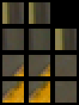

# Laboratorijska vježba: naučena koresponencijska metrika za stereoskopsku rekonstrukciju

## Uvodne riječi


Ova vježba razmatra problem stereoskopske rekonstrukcije.
Naš cilj je razviti algoritam koji će za svaki piksel lijeve slike pronaći odgovarajući (ili korespondentni) piksel desne slike.
Naš pristup temelji se na ugrađivanju slikovnih okana u apstraktni vektorski prostor.

Neka postupak za slikovno ugrađivanje $$h(\mathbf{x}) = \mathbf{y}$$ 
preslikava slikovno okno $$\mathbf{x} \equiv x_{cij} \in \mathbb{R}^{C \times H \times W}$$
u metrički prostor $$\mathbf{y} \equiv y_f \in \mathbb{R}^{f}$$.
Koristimo tzv. [Einsteinov zapis](https://www.continuummechanics.org/tensornotationbasic.html)
koji omogućava izražavanje dimenzionalnosti proizvoljnih tenzora i osi redukcije operatora.
Položaje u slici predstavljamo kao indekse piksela u matrici dimenzija $$H W$$.
Domena para koordinata je $$(i, j) \in [0, H\rangle \times [0, W\rangle$$.

Neka je $$a_ib_i \equiv \mathbf{a}^{T}\mathbf{b}$$ skalarni umnožak vektora $$\mathbf{a}$$ i $$\mathbf{b}$$.
Želimo naučiti slikovno ugrađivanje takvo da vektori korespondentnih okana $$r_f$$ i $$p_f$$
budu bliže jedan drugome od vektora nekorespondentnih okana $$q_f$$.
Radi jednostavnosti i brzine, blizinu ćemo mjeriti skalarnim umnoškom.
Naš kriterij možemo izraziti sljedećom jednadžbom:
$$
r_f p_f > r_f q_f
$$

U zadatku guste stereoskopske rekonstrukcije, traženo ugrađivanje možemo koristiti za izgradnju volumena cijene.
Volumen cijene $$\mathbf{V} \equiv V_{dij} \in \mathbb{R}^{D \times H \times W}$$ 
je trodimenzionalna struktura koja definira negativnu sličnost
referentnog slikovnog okna oko slikovne koordinate $$(i, j)$$ i slikovnog okna pomaknutog za disparitet $$d$$.
Drugim riječima, za ugrađivanja $$r_{fij}$$ i $$p_{fij}$$ volumen cijene definiramo kao:

$$
V_{dij} = -r_{fij} p_{fi(j-d)}
$$

Na ovaj način smo za svaki piksel $$(i, j)$$ definirali cijenu uparivanja okna referentne slike s oknom druge slike na položaju $$(i, j-d)$$.
U praksi, pretraživanje radimo za $$d \in [0, D\rangle$$.
$$D$$ postavljamo sukladno parametrima rektificiranog stereoskopskog para kamera.

### Arhitektura MC-CNN
U okviru ove vježbe, postupak za ugrađivanje izrazit ćemo dubokim konvolucijskim modelom $$h_{\mathbf{\theta}}$$,
a parametre modela $$\mathbf{\theta}$$ ćemo pronaći učenjem na prikladno definiranim podacima.

Naučit ćemo `fast` inačicu modela za korespondencijsku metriku [1](https://www.jmlr.org/papers/volume17/15-535/15-535.pdf).
Model _matching cost convolutional neural network_ (MC-CNN) uvodi prikladan okvir za učenje.
Arhitektura dubokog modela je sekvencijalna i sastoji se od 4 konvolucijska sloja.
Nakon prve tri konvolucije slijedi $$ReLU$$ aktivacijska funkcija.
Izlazni, četvrti konvolucijski sloj, nema nelinearnost.
Sve konvolucije proizvode 64 mape značajki, a sve jezgre su veličine $$3 \times 3$$.
Značajke posljednjeg sloja su normalizirane, nezavisno za svaki prostorni položaj u mapi značajki.

Bitno je naglasiti kako operacija konvolucije sadrži parametar koji definira ponašanje na rubovima.
Naime, ako u konvoluciji $$k \times k$$ želimo zadržati prostornu dimenzionalnost,
potrebno je nadopuniti ulaznu mapu nulama, i to$$\lfloor\frac{k}{2}\rfloor$$ elemenata na svakom rubu.
Međutim, u našem je slučaju korisno ugasiti nadopunjavanje nulama prilikom učenja modela.
Za spomenutu četveroslojnu arhitekturu, ako obrađujemo okno prostorne veličine  $$9 \times 9$$, bez nadopunjavanja
ćemo proizvesti f-dimenzionalni vektor (prostorna dimenzionalnost je $$1 \times 1$$).
Ovo svojstvo će nam pomoći prilikom izražavanja gubitka.

Model se uči trojnim gubitkom. Za ugrađivanja referentnog, pozitivnog i negativnog okna, redom
$$r_f = h_\theta(\mathbf{x}^{ref})$$,
$$p_f = h_\theta(\mathbf{x}^{pos})$$ i 
$$q_f = h_\theta(\mathbf{x}^{neg})$$,
gubitak izražavamo kao:

$$
L(r_f, p_f, q_f) = max(0, r_f p_f - r_f q_f + m)
$$

Dakle, gubitak na skupu za učenje je minimalan kad je sličnost svih pozitivnih i referetnih ugrađivanja
veći od sličnosti referentnih i negativnih ugrađivanja za najmanje $$m$$. Hiperparametar $$m$$ se naziva margina.

Za izražavanje trojnog gubitka, potrebno je izračunati ugrađivanja $$r_f$$, $$p_f$$ i $$q_f$$
na odgovarajućim položajima stereoskopskog para slika.
Podatkovni skup koji koristimo sadrži precizne mape dispariteta dobivene tehnikama koje koriste strukturirano svjetlo.
Ove mape dispariteta $$d_{ij} \in \mathbb{R}^{+}$$ koristimo kako bismo pronašli položaje korespondentnih slikovnih okana.
Za neki položaj u referentnoj slici, $$(i, j)$$, odgovarajući položaj pozitivnog okna u drugoj slici je $$(i, j - d_{ij} * s)$$,
gdje je $$s$$ indikator smjera:

$$
s = 
\begin{cases}
1, & \text{ako je referentna slika lijeva}   \\
-1,& \text{ako je referentna slika desna}   \\
\end{cases}
$$

Negativna okna možemo izračunati nasumičnim pomakom po x-osi slike relativno na pozitivno okno.

### Struktura programskog koda vježbe
Na sljedećem GitHub repozitoriju preuzmite kostur laboratorijske vježbe:
```bash
git clone https://gitlab.com/FER-D307/Nastava/3d-racvid/3drv-lab2.git
```
Većina zadataka ove vježbe svodi se na dopunjavanje implementacija razreda i metoda čija su sučelja već definirana.
Zbog jednostavnosti integracije, predlažemo da sučelja u vašoj implementaciji ostanu nepromijenjena.

Repozitorij prati tzv. [src layout](https://packaging.python.org/en/latest/discussions/src-layout-vs-flat-layout/)
organizaciju koda, stoga na početku rada omogućite Python interpreteru pronalazak pozivom:
```bash
export PYTHONPATH=$PWD/src:$PYTHONPATH
```

Očekivano ponašanje komponenti rješenja možete provjeriti pozivom:
```bash
export TEST_DATA_ROOT=tests/resources
python3 -m unittest
```

Za učenje dubokog modela, pomoći će nam biblioteka [PyTorch](https://pytorch.org/docs/stable/index.html).
Dodatno, dozvoljeno je korištenje radnog okvira koji olakšava postavljanje petlje za učenje.
Za tu svrhu preporučamo [PyTorch Lightning](https://lightning.ai/docs/pytorch/stable/starter/introduction.html).
Za učenje modela u konačnom vremenu, potrebna je GPU okolina poput Google Colaba.

## Priprema podataka za učenje

### Preuzimanje skupa Middlebury
Čitavu vježbu temeljit ćemo na skupovima slika [Middlebury](https://vision.middlebury.edu/stereo/data/).
Izdanja  2001, 2003, 2005 i 2006 služit će za učenje metričkog ugrađivanja, a izdanje iz 2014. za vrednovanje.
Za preuzimanje koristite pripremljenu skriptu `scripts/download_middlebury.py`:
```bash
python3 scripts/download_middlebury.py --data-dir <putanja/za/spremanje>
```
Očekivana veličina preuzetih podataka je 2.7GB.

### Zadatak 1: priprema trojki za učenje

Preuzete podatke iz skupa Middlebury je potrebno učitati u odgovarajuće `torch.Tensor` strukture.
Koristite apstrakciju `torch.utils.data.Dataset` i napišite odgovarajuće implementacije za učitavanje podataka.
Predlažemo da koristite osnovnu klasu iz `src/data/datasets/middlebury/middlebury.py`
koja prikladno učitava parove slika i mape dispariteta, a brigu o dohvaćanju putanja za svaku od godina ostavite
konkretnim implementacijama (`Midlebury2001`, `Middlebury2003`...).
Neka vam sljedeća tablica pomogne:

| Verzija | Skaliranje dispariteta | Namjena     | Stereoskopski par | Imena slika   | Imena mapa dispariteta |
|---------|------------------------|-------------|-------------------|---------------|------------------------|
| 2001    | 8                      | učenje      | (2, 6)            | im<idx>.ppm   | disp<idx>.pgm          |
| 2003    | 4                      | učenje      | (2, 6)            | im<idx>.ppm   | disp<idx>.pgm          |
| 2005    | 3                      | učenje      | (1, 5)            | view<idx>.png | disp<idx>.png          |
| 2006    | 3                      | učenje      | (1, 5)            | view<idx>.png | disp<idx>.png          |
| 2014    | 1                      | vrednovanje | (0, 1)            | im<idx>.png   | disp<idx>.pfm          |

Posebno valja voditi računa o sljedećem:
- stupac `Skaliranje dispariteta` govori kojim faktorom treba smanjiti disparitete učitane s diska.
- Dispariteti su definirani u oba smjera.
Primjerice, za izdanje 2001, `disp2.pgm` sadrži disparitete za lijevu referentnu sliku `im2.ppm` prema `im6.ppm`,
no vrijedi i obrnuto (referentna desna `im6.ppm`, uz disparitet `disp6.pgm`, prema `im2.ppm`).
Potrebno je odrediti odgovarajući indikator smjera `s`.

Za učitavanje slika i dispariteta, potrebno je implementirati metode u modulu `src/data/disparity.py`.
Koristite biblioteku [Pillow](https://pillow.readthedocs.io/en/stable/) koja može učitati formate `ppm` i `pfm`.

Ispravnost svih sučelja možete provjeriti pozivom:
```bash
python3 -m unittest tests/test_data/test_disparity.py
```

Konkretne podrazreda razreda `data.dataset.middlebury.middlebury.MiddleburyDataset` implementirajte koristeći metode
za učitavanje slika i dispariteta.
Ispravnost vlastite implementacije konkretnih podrazreda provjerite pozivom:
```bash
python3 -m unittest tests/test_data/test_datasets/test_middlebury/test_middlebury.py
```

Jednom kad implementirate podrazrede, potrebno je pripremiti slikovna okna za učenje trojnim gubitkom.

Modul `src/data/triplets.py` sadrži metodu `extract_triplets` koja prima učitani par slika, disparitet,
prostorne dimenzije izrezanih okana te indikator smjera $$s$$ (`direction`),
a vraća sve trojke za učenje za ulazne parove slika.
Trojke se dobivaju ovako:
- za svaki valjani disparitet referentne slike, izrežite okno prostorne veličine $$p \times p$$.
- Oko položaja pomaknutog za iznos dispariteta, izrežite pozitivno okno u drugoj slici.
- Negativno okno izrežite na isti način kao i pozitivno,
no pomaknite iznos dispariteta za nasumičan iznos iz $$[o_l, o_h]$$ u bilo kojem smjeru.

$$[o_l, o_h]$$ je smisleno postaviti na vrijednosti blizu $$[4, 20]$$.
Za učenje modela MC-CNN, veličinu okna valja postaviti na $$p=9$$.
Vodite računa kako mape dispariteta sadrže vrijednosti koje nisu validne:
vrijednosti $$0$$ i $$+\inf$$ sugeriraju da na tom pikselu disparitet nije definiran.
Konačno, obratite pažnju na rubne piksele, pošto će dio okana ispadati izvan rubova slike.

Zbog brzine izvođenja, predlažemo da koristite gotovu implementaciju za pronalazak slikovnih okana.
Izdvojili smo metodu `extract_patch_around_position` koja prima sliku i tenzor koordinata oblika `[(n, x1, y1, x2, y2)]`
te na temelju parametra `patch_size` izrezuje odgovarajuće dijelove slike. Ovaj zapis koordinata odgovara pozivu metode
[roi_align](https://pytorch.org/vision/main/generated/torchvision.ops.roi_align.html).
`roi_align` se može iskoristiti za memorijski efikasno izrezivanje, no potrebno je paziti da se koordinate namjeste
tako da se susjedne točke ne interpoliraju. 
Izrezivanje se može dobiti i indeksiranjem tenzora koji se dobije operacijom
[im2col](https://pytorch.org/docs/stable/generated/torch.nn.Unfold.html).

Ispravnost možete provjeriti pozivom:
```bash
python3 -m unittest tests/test_data/test_triplets.py
```

Implementirane funkcionalnosti iskoristite u `scripts/extract_triplet_patches.py`.
Skripta učitava podatke iz skupa Middlebury koje smo namijenili za učenje, priprema okna za učenje,
i serijalizira ih na disk. Za svaku scenu spremite sliku koja sadrži nekoliko okana za vizualnu inspekciju, poput ove:



Predlažemo da trojke spremite u strukturu riječnika s ključevima `r`, `p` i `q`.
Sve trojke za učenje možete serijalizirati u jednu veliku datoteku,
pozivom [torch.save](https://pytorch.org/docs/main/generated/torch.save.html).

Očekivano zauzeće na disku, ako okna spremate u preporučeni `uint8` podatkovni tip, je oko 5.7GB.

### Zadatak 2: učenje modela

Pripremljene podatke koristit ćemo za izražavanje spomenutog trojnog gubitka.
Preostaje nam izraziti model i optimizacijski postupak.
Preporučamo osloniti se na okvir `pytorch_lightning`.

#### Model
U modulu `src/model/mc_cnn.py` potrebno je izraziti model MC-CNN korištenjem radnog okvira PyTorch.
Razred obavezno mora sadržavati metodu `forward` koja prima slikovni tenzor, a vraća ugrađivanje.
Vodite računa kako gubitak očekuje normalizirane vektore ([F.normalize](https://pytorch.org/docs/stable/generated/torch.nn.functional.normalize.html)).
Dodatno, implementirajte i metodu `forward_cost_volume`, koja prima slikovni par, poziva `forward`
za svaku sliku, te na temelju ugrađivanja računa volumen cijene.
U modulu smo izdvojili metodu `create_cost_volume` koju trebate koristiti u pozivu `forward_cost_volume`.
Ispravnost oblika povratnih vrijednosti provjerite s:
```bash
python3 -m unittest tests/test_model/test_mc_cnn.py
```

#### Podaci

U modulu `src/data/datasets/triplet_dataset.py`, potrebno je implementirati `torch.utils.data.Dataset` podrazred
koji omogućava čitanje spremljenih trojki s diska.
Ovisno o tome kako ste pripremili trojke, možete raditi s jednom ili više datoteka.
Neka ovaj razred omogućava čitanje svih trojki u skupu za učenje, a metoda `__getitem__` neka podržava indeksiranje
vektorima indeksa:
```bash
python3 -m unittest tests/test_data/test_datasets/test_triplet_dataset.py
```

Konačno, podatke ćemo objediniti korištenjem razreda `lightning.LightningDatamodule` okvira `pytorch_lightning`.
Naša implementacija se nalazi u `src/data/middlebury_datamodule.py` (razred `MiddleburyDatamodule`).
Prilikom učenja modelu prosljeđujemo grupu trojki dobivenu indeksiranjem objekta razreda `TripletDataset`.
Paralelno učitavanje i slaganje grupe dobiva se omatanjem objekta razreda `TripletDataset` u `torch.utils.data.DataLoader`.
Ova konstrukcija događa se pozivom `train_dataloader`.
Slično tome, objekt razreda `Middlebury2014` se omata u metodi `val_dataloader`.
```bash
python3 -m unittest tests/test_data/test_middlebury_datamodule.py
```

#### LightningModule
`pytorch_lightning` koristit ćemo i za omatanje objekta tipa `McCnn` razredom `McCnnModule` koji je definiran u
`src/model/mc_cnn_ligtning`.
Metoda `training_step` definira unaprijedni prolaz modela te izračun trojnog gubitka.
Ulazu ove metode prosljeđuju se primjeri koji se dobivaju iteracijom kroz objekt dobiven pozivom `train_dataloader()` `*`.
`training_step` u argumentu `batch` očekuje riječnik koji pod ključevima `r`, `p` i `q` sadrži slikovna okna.
U metodi je potrebno pozvati model i kao povratnu vrijedmost vratiti skalarni iznos gubitka.

Neka konstruktor razreda `McCnnModule` prima i dodatna 2 `torch.nn.Module` objekta,
`aug_train` i `aug_test`, koji augmentiraju podatke.
Pozivi ovih metoda neka se zbivaju prije proslijeđivanja ulaza modelu,
ali nakon pretvorbe podatkovnog tipa iz `uint8` u `float32` `**`.
Augmentacija podatka prilikom učenja povećava robusnost na promjene ulaza.
Vodite računa da primjenjujete augmentaciju nezavisno za svako okno trojke za učenje.
Augmentacija prilikom testiranja omogućava prilagodbu ulaza (primjerice, interpolacija slike).
Predlažemo korištenje biblioteke [kornia](https://kornia.readthedocs.io/en/latest/augmentation.module.html).

Metoda `validation_step` predstavlja obradu jednog para slika iz `Middlebury2014`.
U metodi je potrebno modelom obraditi ulazni par slika, izračunati volumen cijene, te za svaki piksel vratiti
iznos dispariteta za koji je cijena najmanja.
Dobiveni disparitet potrebno je usporediti s pravim disparitetom kako bi vrednovali postupak.
Za neki disparitet smatramo da je točan ako je apsolutna udaljenost od stvarnog dispariteta unutar 2 piksela. 
Snimite točnost na validacijskom skupu. Bez obrade volumena cijene (samo `argmin`-om) očekujte oko 30% točnosti.

Postoji mogućnost da su izvorne Middlebury 2014 slike prevelike za obradu u jednom prolazu.
U tom slučaju možete smanjiti slike na ulazu u model.
Vodite računa kako je tad potrebno interpolirati mapu dispariteta, a vrijednosti u mapi skalirati
(pomak od 1px na 4 puta manjoj širini slike odgovara pomaku od 4px u izvornoj slici).

`*` Prilikom učenja, povezivanje podataka za korisnika radi `pytorch_lightning`.

`**` Numerička diferencijacija radi se u prostoru kontinuiranih vrijednosti.

#### Petlja učenja

Petlju učenja u `scipts/train.py` prepuštamo okviru `lightning`.
Primijetit ćete kako ovdje ne postoji konstrukcija objekata relevantnih razreda.
Konstrukcija se zbiva na temelju konfiguracijske datoteke.
Ako vaša implementacija prati sučelja koja smo definirali za vas,
možete koristiti konfiguraciju `train_cfg/default.yaml` bez preinaka.
U datoteci smo ostavili nekoliko komentara koji bi vam mogli pomoći u snalaženju.

Poziv petlje učenja:
```bash
python3 scripts/train.py fit -c train_cfg/default.yaml
```
Ako ste uspješno implementirali sve funkcionalosti, trebali biste vidjeti kako gubitak opada `*`.
Pri završetku učenja, parametri modela bit će spremljeni na disku.
Parametre treniranog modela su potrebni u idućem koraku.


`*` U našoj implementaciji, jedna epoha učenja traje oko 10 minuta i tad postaje jasno konvergira li učenje.

### Zadatak 3: prikaz i vizualizacija rezultata
Cilj posljednjeg zadatka je pronaći validacijske scene u kojima postupak radi najbolje odnosno najgore.
Dopuinte skriptu u `scripts/validate.py` tako da:
1. Izračunate mapu dispariteta za svaki par iz skupa Middlebury 2014.
2. Za svaku mapu dispariteta:
   * izračunajte pogrešku,
   * spremite mapu dispariteta na disk,
   * spremite pogrešku svakog piksela kao sliku. Iznos pogreške kodirajte sljedećim bojama:
     * crna: nevažeći disparitet,
     * zelena: pogreška unutar $$[0\text{px}, 2\text{px} \rangle$$,
     * žuta: pogreška unutar $$[2\text{px}, 8\text{px}\rangle$$,
     * crvena: pogreška $$> 8\text{px}$$.
3. Pripremite tablicu koja za svaki par slika prikazuje pogrešku.
Prilikom predaje vježbe pripremite tablicu s rezultatima i slike koje vizualiziraju pogrešku.

