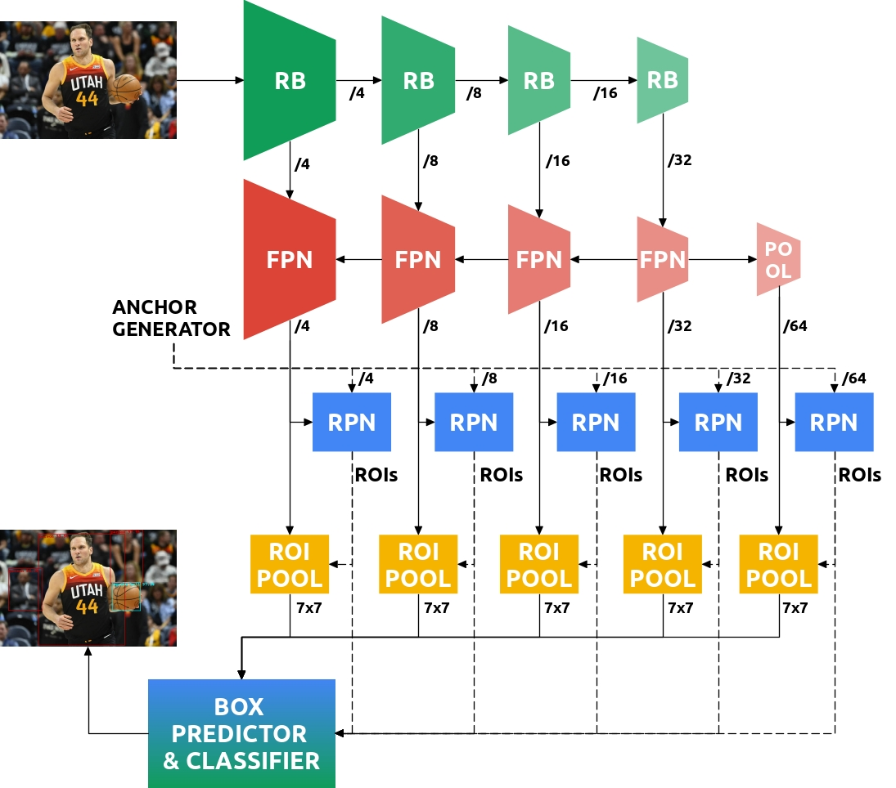
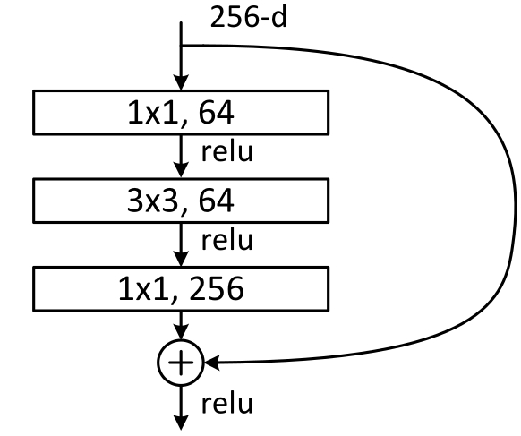
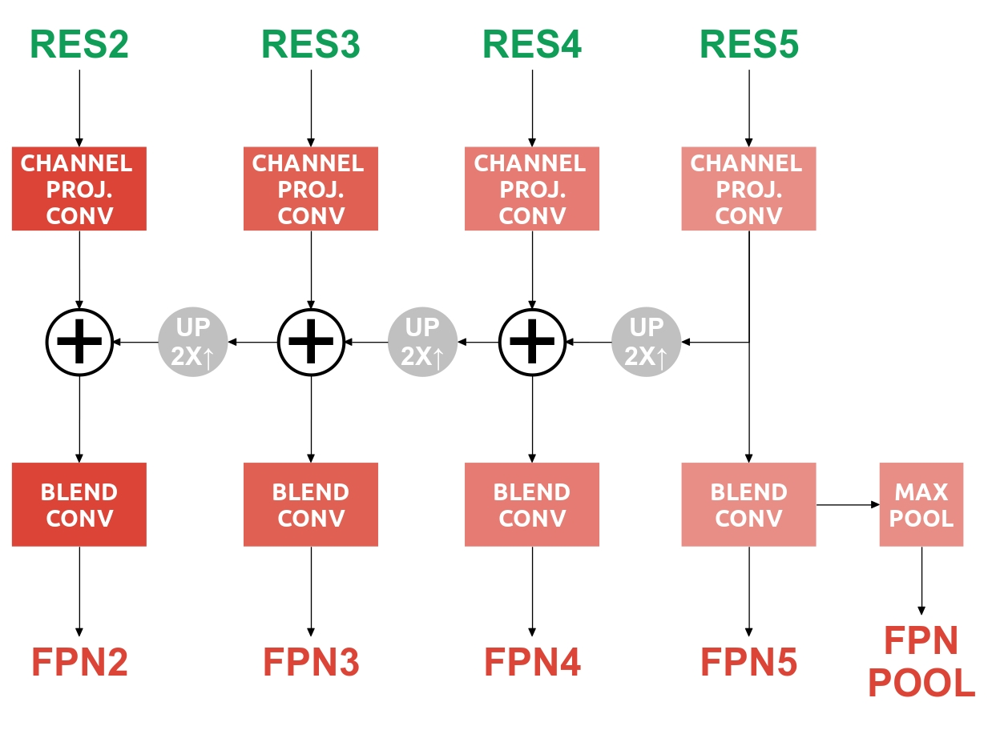
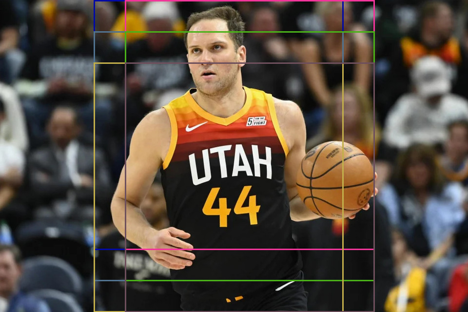
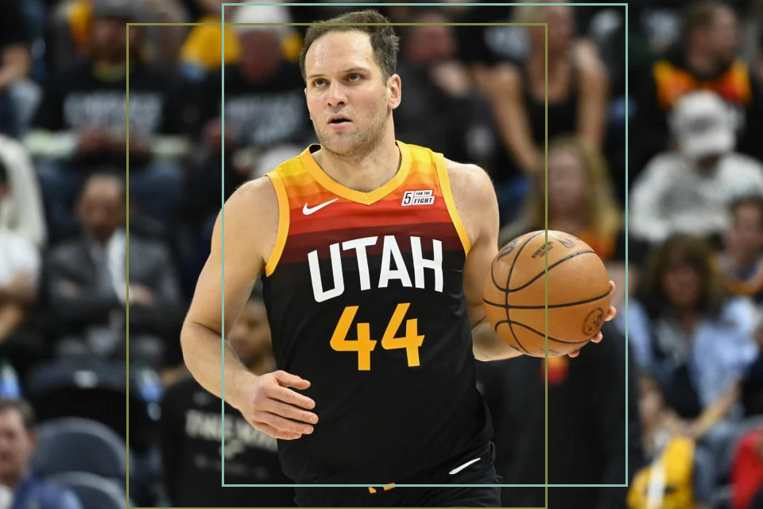
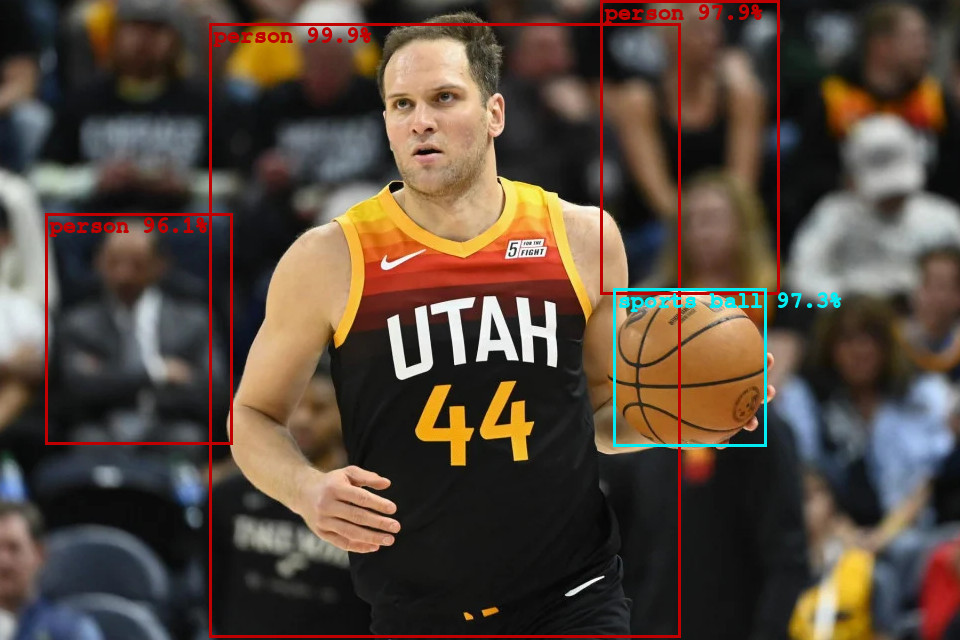

# Third laboratory exercise: object detection

In this exercise, we will focus on object detection in images - one of the most important tasks in computer vision. Object detection involves the localization and classification of objects within an image. Localization is typically achieved by estimating the coordinates of a rectangle that best describes the object. Early approaches primarily dealt with binary object detection (such as the Viola-Jones algorithm), while more recent methods involve multi-class detection.

The problem with early approaches was extracting shared features that would be good enough for recognizing objects of different semantic classes. This problem has been addressed with the advent of deep models and end-to-end learning capabilities.

The development of object detection algorithms has been accompanied by the evolution of datasets. For a long time, the standard dataset was [PASCAL VOC](http://host.robots.ox.ac.uk/pascal/VOC/), which distinguishes 20 object classes. Recently, this position has been taken over by the [MS COCO](https://cocodataset.org/#home) dataset, which identifies 80 object classes. Recognition across over 1000 different semantic classes is now being considered with the [LVIS](https://www.lvisdataset.org/) dataset.

Modern approaches to object detection are based on deep models, and several distinctions exist among them. The most popular approaches assume anchor boxes at all locations on the feature map and predict the relative shifts and scales of these boxes to best describe the object. Examples of this group include popular approaches like Faster R-CNN, SSD, YOLO, and others. Other approaches (e.g., CornerNet) detect objects using key points paired based on predicted embeddings. Transformers have introduced a new approach based on predicting a set of queries, from which the object's location and classification are directly computed.

In this exercise, we will delve into the Faster R-CNN model, specifically the version based on feature pyramids.

# Faster R-CNN
The key components of the Faster R-CNN model that we will study are:
- The backbone, which computes image features,
- The upsampling path (FPN, feature pyramid network) that calculates a feature pyramid of approximately equal semantic levels,
- The region proposal network (RPN) for proposing regions of interest,
- The region of interest (RoI) pooling layer,
- And the final layer for region classification and fine-tuning of bounding boxes.

<em>Image 1. The architecture of the Faster R-CNN model based on the feature pyramid.</em>

In Figure 1, a detailed inference path of the Faster R-CNN model is presented, illustrating the interaction among the mentioned components.

Considering that training such a model requires significant computational resources, in this exercise, we will focus solely on the forward pass of a pre-trained model on the COCO dataset. Your task will be to augment the provided implementation of the Faster R-CNN model. The instructions will guide you through the implementation step by step. The correctness of each step in your solution will be verified through tests comparing intermediate results of your implementation with those of the original implementation.

## 1. Environment installation
For the purposes of this exercise, we will use Python 3 along with the following Python packages:
- [PyTorch](https://pytorch.org/)
- [torchvision](https://pytorch.org/vision/stable/index.html)
- [Pillow](https://python-pillow.org/)
- [Matplotlib](https://matplotlib.org/)
- [NumPy](https://numpy.org/)

After ensuring that you have all the required packages, download the exercise skeleton from [GitHub](https://github.com/cvunizg/cvunizg-lab3-faster). Then, within the repository, create a new directory named `data` and unpack the contents of this [directory](https://www.dropbox.com/sh/wbybqchx98wg8ci/AAA_2KlewTokFc2OY-fC0_wna?dl=0) into it. The downloaded file contains saved intermediate results of the forward pass of the considered model, which will be used during the tests.
## 2. Backbone
The process of building the Faster R-CNN model begins with feature extraction using the backbone. The backbone typically consists of a classification model without global pooling and a fully connected layer, which has been pre-trained on ImageNet. By initializing the backbone with ImageNet parameters, we expedite the training process for the specific task and reduce the amount of densely labeled images required. In cases of limited computational resources, during the training of the detection model, backbone parameters can be frozen. Nevertheless, it is more common for these parameters to be fine-tuned during training for object detection.

Our considered model utilizes the ResNet-50 model as a backbone, which belongs to the family of models with residual connections. The basic building block of the ResNet-50 model and its larger siblings (ResNet-101, ResNet-152) is depicted in Figure 2. For such a residual unit, we say it has a bottleneck because the initial 1x1 convolution reduces the number of channels. This significantly reduces the memory and computational footprint, as a more expensive 3x3 convolution follows. Finally, the number of channels is inflated again with the help of a second 1x1 convolution. In the figure, you can observe the skip connection that adds the input to the residual unit to the result of the processing from the convolutional layers. This enables the model to have better gradient flow to earlier layers and learn simpler residual mappings that correspond to the difference between the input and the "desired" output.

<em>Figure 2. Residual Convolutional Unit with Bottleneck.</em>

In Figure 1, the backbone is depicted in shades of green and consists of four residual blocks. By a block, we denote a set of residual units operating on features with the same spatial resolution. Thus, the first residual block outputs features that are subsampled by a factor of four compared to the input image, as indicated by "/4" on the corresponding arrows in Figure 1. Similarly, the second residual block produces features subsampled by a factor of 8, the third by 16, and the fourth by 32. In the literature, these features are often referred to with the prefix "res" and a number corresponding to the exponent of the power of 2 that denotes the subsampling level. For instance, the outputs of the first residual block are labeled as "res**2**" because they are subsampled by a factor of 2^**2** = 4 compared to the input image. The outputs of the second residual block are labeled as "res**3**" since they are subsampled by a factor of 2^**3** = 8. Similarly, we will denote the features of the remaining two blocks as "res**4**" and "res**5**".

### Problems

1. Considering that the utilized backbone expects a normalized image as input, your first task is to implement a function for image normalization. Find the declaration of the function `normalize_img` in the file `utils.py`. The function takes a tensor `img` as input, which has the shape (H, W, 3) where H and W are the dimensions of the image. The function should return a normalized tensor of shape (3, H, W). Normalization involves scaling to the range [0-1], subtracting the mean value `image_mean`, and dividing by the standard deviation `image_std`. The mean value and standard deviation have a shape of (3). You can verify the correctness of your implementation by running the test script "test_backbone.py." Navigate to the root directory of the project and execute `python3 -m  tests.test_backbone` in the terminal.

2. Complete the implementation of the ResNet model in the file `resnet.py`. First, according to Figure 2, complete the `Bottleneck.forward` method, which implements the forward pass through the bottleneck residual unit. Then, in the `ResNet._forward_impl` method, save the outputs from the residual blocks in the dictionary `out_dict` with keys "res2," "res3," "res4," and "res5." Note that in the code, the first residual block is labeled as `layer1`, the second as `layer2`, and so on. Check the correctness of your implementation by running the same test script as in the previous task.

3. How many channels do the outputs from each residual block have? Which residual block's features are semantically richest, and which are spatially most precise?

## 3. Upsampling path

Generally, the task of the upsampling path is to construct a semantically rich representation that is simultaneously spatially precise. Notice that none of the outputs from the backbone satisfies both of these criteria. Features from later blocks in the backbone are more semantically rich, but their spatial resolution is lower. On the other hand, features from earlier blocks in the backbone have finer resolution and, as a result, are spatially more precise, but they are less semantically rich. Therefore, the upsampling path gradually builds the desired representation by upsampling a semantically rich representation and combining it with spatially more precise features. Different versions of this idea are present in many models for dense prediction.

Special variations of the upsampling path are present in object detection, where instead of a representation at a single level, a feature resolution pyramid is built. The reason for this is that relying solely on features from a single level would likely result in a lack of scale invariance. For instance, lower-resolution features are good for detecting large objects but may perform poorly in detecting small ones, as information about their presence could be lost due to downsampling. On the other hand, at higher resolutions, there might be challenges in detecting large objects due to the limited receptive field of convolutional models.

Therefore, even the earliest deep models for object detection, such as [SSD](https://arxiv.org/pdf/1512.02325.pdf), consider a feature pyramid. They directly regress descriptive bounding boxes from features at different resolutions in the backbone. However, the challenge with such an approach is that features from different stages of the backbone are also at different semantic levels. This issue is addressed by [FPN](https://arxiv.org/pdf/1612.03144.pdf), which employs an additional upsampling path to construct a semantically rich and uniform resolution feature pyramid.

Our version of the Faster R-CNN model also utilizes FPN. In Figure 1, the upsampling path is marked in red. Different shades of red indicate that modules for each level of the pyramid use different parameters. Each upsampling module consists of two convolutional units. One is applied to the corresponding features from the backbone (often called skip or lateral connections) to equalize the number of channels with the upsampling path. In the literature, these convolutions are often referred to as channel projections. The second convolutional unit is applied to the sum of the skip connection and the upsampled feature map from the previous level to compute the final representation at that level of the pyramid. For a more detailed illustration of the considered upsampling path, refer to Figure 3.

<em>Image 3. A more detailed depiction of the upsampling path that constructs the feature pyramid.</em>

### Problems

1. In the file `utils.py`, implement the `ConvNormActBlock` module, whose forward pass consists sequentially of a convolutional layer, optionally an activation function, and optionally a normalization layer. Note that the module inherits from the `nn.Sequential` class, which sequentially applies the specified list of layers. To add a layer to the list, you can use the `self.append` method. Set the `padding` argument that controls padding during convolution to preserve the spatial dimensions of the input.

2. In the file `fpn.py`, implement the forward pass of the upsampling path in the `FeaturePyramidNetwork.forward` method. Implement the forward pass according to Figure 3. Pay attention to the comments written in the code.

3. Test your implementation of the upsampling path by running the command `python3 -m tests.test_fpn`.

## 4. Region Proposal Network (RPN)
Zadaća mreže za predlaganje regija od interesa 
je izdvojiti pravokutne regije unutar kojih bi 
se mogao nalaziti neki objekt.
Taj zadatak sveden je na binarnu klasifikaciju
sidrenih okvira u pozitive i negative.
Negativi se odbacuju jer su to okviri koji ne sadrže objekte,
dok se pozitivi parametriziranom transformacijom
mijenjaju na način da preciznije uokviruju ciljani objekt.
Primijetite da mreža za predlaganje regija od interesa
ne razlikuje semantičke razrede objekata 
(u literaturi se često koristi engl. izraz class-agnostic).
Njena zadaća je samo procijeniti
bi li se neki objekt mogao nalaziti
unutar razmatranog sidrenog okvira ili ne.
Pozitivni okviri se transformiraju parametrima $$t_x, t_y$$
koji kontroliraju horizontalni i vertikalni pomak centra okvira
te parametrima $$t_w, t_h$$ koji kontroliraju 
horizontalno i vertikalno skaliranje okvira.
Za spomenute parametre vrijede sljedeće jednadžbe:

$$
\begin{align}
t_x &= \frac{x - x_a}{w_a} \\
t_y &= \frac{y - y_a}{h_a} \\
t_w &= \log \frac{w}{w_a} \\
t_h &= \log \frac{h}{h_a}
\end{align}
$$

gdje $$x_a, y_a, w_a, h_a$$ predstavljaju koordinate centra, širinu i visinu sidrenog okvira,
a $$x, y, w, h$$ predstavljaju koordinate centra, širinu i visinu ciljanog objekta.

Iz slike 1 vidljivo je da se mreža 
za predlaganje regija od interesa
primjenjuje na svaku razinu piramide značajki.
Jednaka nijansa plave boje za svaku razinu piramide
sugerira dijeljenje parametara.
Pored značajki ulaz u RPN čine i sidreni okviri
koji se također generiraju ovisno o razini piramide.
Konkretno, generator sidrenih okvira
smješta okvire u svakom pikselu
razmatranog tenzora značajki,
a njihova veličina ovisi o razini piramide.
Tako se na razini piramide najveće rezolucije
pretpostavljaju sidreni okviri najmanje osnovne veličine
jer na toj razini želimo detektirati male objekte.
Obrnuto, na razini piramide najmanje rezolucije
nalaze se sidreni okviri najveće osnovne veličine
jer na toj razini želimo detektirati velike objekte.
Važan detalj je da generator sidrenih okvira
ne pretpostavlja samo jedan okvir po lokaciji,
nego više njih, a razlikuju se po omjeru visine i širine
kako bi se mogli detektirati objekti različitih oblika.
Konkretno, u modelu kojeg mi razmatramo
osnovne veličine sidrenih okvira su [32, 64, 128, 256, 512]
za redom razine piramide [fpn2, fpn3, fpn4, fpn5, fpn6],
a razlikuju se omjeri visine i širine [1:1, 1:2, 2:1].
RPN također zasebno razmatra
svaki od pretpostavljenih sidrenih okvira
na nekoj lokaciji.
To znači da RPN klasifikator
predviđa onoliko mapa značajki
koliko ima pretpostavljenih sidrenih okvira
u svakoj lokaciji.
Slično tome, RPN regresor parametara transformacije
predviđa 4 puta više mapa značajki
negoli ima pretpostavljenih sidrenih okvira
u svakoj lokaciji.
Na slici ispod prikazani su sidreni okviri
čiji je omjer presjeka i unije
s okvirom igrača na slici
veći od 0.65.

 <em>Slika 4. Pretpostavljeni sidreni okviri koji se s okvirom košarkaša na slici preklapaju s omjerom presjeka i 
unije većim od 0.65</em>

Spomenimo još da RPN ne propušta sve pozitivne okvira kroz unaprijedni prolaz.
Nakon što se odbace negativi i na 
pozitive primjeni predviđena transformacija,
pristupa se filtriranju.
Prvo se odbacuju okviri čija je površina manja od zadane, 
a zatim i oni koji imaju vjerojatnost prisutnosti objekta
nižu od zadanog praga.
Nakon toga se potiskuju nemaksimalni odzivi,
odnosno okviri koji imaju visoko preklapanje s nekim drugim pouzdanim okvirom.
Konačno, propušta se samo 1000 okvira s najvećom vjerojatnošću.
Ovo filtriranje značajno ubrzava unaprijedni prolaz kroz mrežu.
Na slici ispod prikazani su okviri koje je predložio RPN,
a imaju omjer presjeka i unije s okvirom igrača na slici
veći od 0.65.

 <em>Slika 5. Regije od interesa predložene od strane RPN-a koje se s okvirom košarkaša na slici preklapaju s 
omjerom presjeka i unije većim od 0.65.</em>

### Problems
1. U datoteci `rpn.py` dovršite inicijalizaciju klasifikatora i regresora RPN-a u modulu RPNHead.
2. U datoteci `utils.py` dovršite implementaciju funkcije `decode_boxes` koja primjenjuje predviđenu transformaciju 
   na sidrene okvire. Implementaciju testirajte naredbom `python3 -m tests.test_decode_boxes`.

## 5. Region Of Interest Pooling
Sažimanje po regijama (engl. Region of Interest Pooling, ROIPool)
izlučuje reprezentaciju fiksne veličine 
za sve regije od interesa koje predlaže RPN.
Sažimanje po regijama prvo odredi
područje u razmatranom tenzoru značajki
koje odgovara regiji od interesa.
Zatim se to područje dijeli
na manja podpodručja 
približno jednake veličine,
a njihov broj određen je parametrom modela.
Zatim se iz značajke svakoga područja
sažimlju prema zadanoj funkciji (npr. maksimumom).
Ovaj proces ilustriran je na gif-u ispod
za tenzor značajki sa samo jednim kanalom
i zadanom veličinom izlaza 2x2.

 <em>Slika 6. Ilustracija operacije sažimanja po regijama od interesa. Izvor: Deepsense.ai.</em>

U našem razmatranom modelu 
veličina izlaza ROIPool-a je 7x7,
ali to ne znači da se svaki 
okvir predstavlja sa samo 49 značajki.
Taj broj treba još pomnožiti s brojem kanala 
razmatranog tenzora značajki
što odgovara broju kanala FPN-a, 
a to je 256.
Dakle, svaki okvir predstavljen je s 7x7x256=12544 značajki.
Spomenimo još da novije inačice dvoprolaznih modela
obično koriste napredniji algoritam ROIAlign koji 
koristi interpolaciju umjesto kvantizacije
za određivanje rubnih vrijednosti.

## 6. Semantička klasifikacija i fino ugađanje okvira
Završni modul našeg razmatranog modela 
na ulazu prima sažetu reprezentaciju i koordinate
svih regija od interesa koje je predložio RPN.
Zadaća ovog modula 
je semantička klasifikacija
pristiglih okvira
i predviđanje paramatera 
još jedne transformacije
za fino ugađanje okvira 
na željene objekte.
Razlika u odnosu na RPN je što ovaj modul
klasificira okvire u 
jedan od semantičkih razreda ili pozadinu.
Postojanje razreda koji predstavlja pozadinu
omogućuje modelu da i u ovome koraku
odbaci neke okvire koje smatra negativima.

Zanimljiv detalj je da se za svaki okvir
predviđaju odvojeni parametri transformacije
za svaki od semantičkih razreda.
Možemo zamisliti kao da svaki okvir
umnožimo onoliko puta koliko imamo razreda
i za svaki od njih predvidimo 
parametre transformacije.
Ovo omogućuje detekciju 
preklapajućih objekata različitih razreda.

Ovaj modul prvo računa dijeljenu reprezentaciju
za klasifikacijsku i regresijsku glavu
uz pomoć dva potpuno povezana sloja.
Zatim se na tu reprerzentaciju primjenjuju
još dva potpuno povezana sloja:
jedan za klasfikaciju,
a drugi za regresiju 
semantički ovisnih 
parametara transformacije.

### Problems
1. U datoteci `faster.py` dovršite implementaciju funkcije `forward` u modulu `TwoMLPHead`.
2. U datoteci `faster.py` dovršite inicijalizaciju klasifikacijske i regresijske glave u modulu `FastRCNNPredictor`.
3. U datoteci `run_faster.py` implementirajte iscrtavanje rezultate detekcije za sve okvire čija je pouzdanost veća od 
   0.95.
4. Pokrenite program naredbom `python3 run_faster.py` i provjerite je li detekcija uspješna.

Očekivani rezultat izvođenja programa `run_faster.py` prikazan je na slici ispod.

 <em>Slika 7. Rezultat izvođenja modela Faster R-CNN treniranog na skupu COCO.</em>
